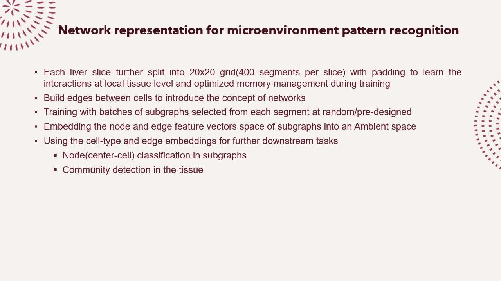
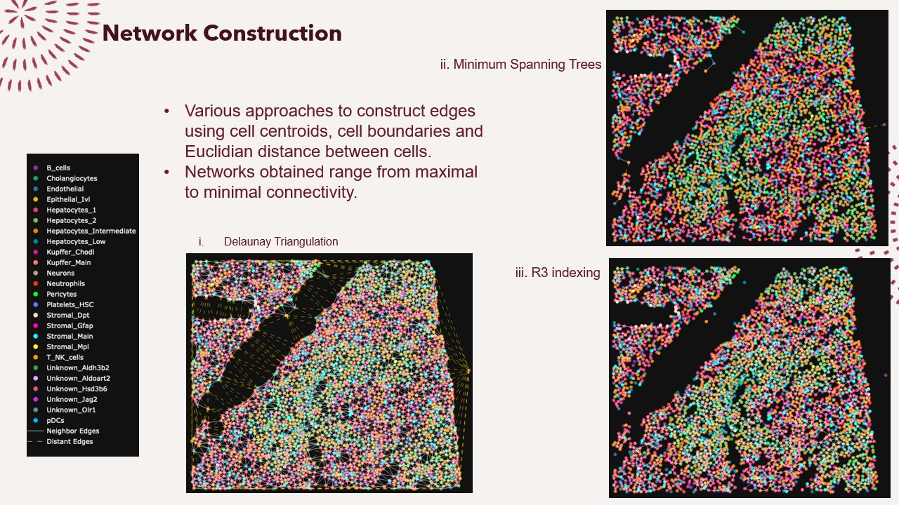
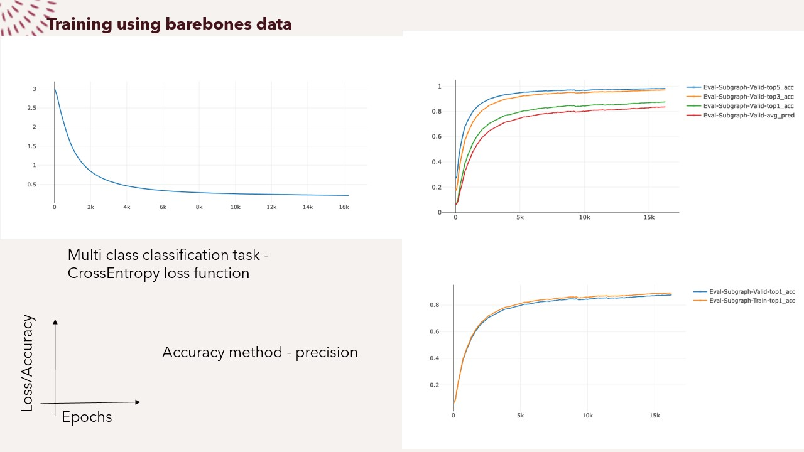

<!-- Needs changes -->

Python env setup
load python 3.8 module
in SLURM - module load python/3.8.18 (verify the version using "module avail" command)

<!-- to ensure virtual environments are created in the local directory -->
use "poetry config virtualenvs.in-project true"
to install - "poetry install"

activate virtual environment created by poetry in the project directory
source .venv/bin/activate

<!-- to be able to install torch-scatter, open issue at https://github.com/rusty1s/pytorch_sparse/issues/156 -->
<!-- please refer here for different options -->
https://pytorch-geometric.readthedocs.io/en/latest/install/installation.html

poetry config repositories.torch-wheels https://data.pyg.org/whl/torch-2.2.0+cpu.html

poetry source add torch-wheels https://data.pyg.org/whl/torch-2.2.0+cpu.html

if using slurm jobs, create directory for logs using mkdir logs

jupyterlab setup details can be found at https://jejjohnson.github.io/research_journal/tutorials/remote_computing/vscode_jlab/

docs setup
---------------
mkdir docs
cd docs
sphinx-quickstart
-- update conf.py

from project directory
sphinx-apidoc -o docs/source/ graphxl/
sphinx-build -b html docs/source docs/build

from docs directory
./make.sh html

from docs/build directory
python -m http.server to run the docs server locally

